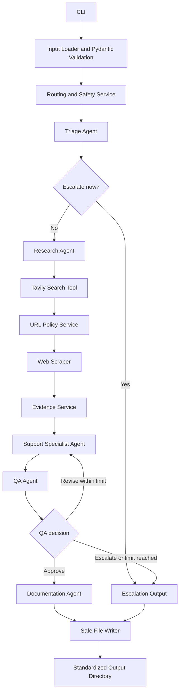

# Combined Phases 5-7 Architecture, Agent, and Contract Specification

## System Context
SupportScout is a local CLI application. It reads one synthetic JSON support ticket, applies deterministic safeguards, coordinates specialized agents and tools, and writes validated JSON and Markdown artifacts. It does not connect to a real customer system.

## Component Architecture



## Layers and Responsibilities

### CLI Layer
Parses input path and safe options, loads configuration, starts the orchestrator, and returns useful exit codes.

### Orchestrator
Owns workflow state, ordering, retries, revision limits, terminal status, and sanitized audit events. It does not perform model inference, HTTP retrieval, or file formatting itself.

### Agents
Interpret language and produce validated structured decisions or drafts. They do not directly read credentials, call arbitrary URLs, or write files.

### Tools
Perform bounded external or deterministic operations: Tavily search, page retrieval, HTML parsing, and file writing.

### Services
Apply URL policy, routing rules, evidence preparation, provider isolation, and sanitization.

### Schemas
Define all input, handoff, state, and output contracts through Pydantic.

## Agent Specifications

### Triage Agent
**Input:** `SupportTicket`  
**Output:** `TicketClassification` and `SentimentAssessment`  
**May:** Interpret domain, intent, sentiment, urgency, and uncertainty.  
**Must not:** Authorize actions, call tools, or override deterministic safety rules.

### Research Agent
**Input:** Sanitized ticket context and classification  
**Output:** `SearchPlan`  
**May:** Generate a bounded set of general research queries and desired source characteristics.  
**Must not:** Include secrets or unnecessary order/account identifiers; fetch URLs directly.

### Support Specialist Agent
**Input:** Sanitized ticket context, classification, and `ScrapedEvidence[]`  
**Output:** `SupportDraft`  
**May:** Summarize the issue and propose evidence-grounded troubleshooting.  
**Must not:** Claim account access, policy authority, refund action, or unsupported resolution.

### QA Agent
**Input:** Support draft, evidence, classification, and escalation rules  
**Output:** `QAResult`  
**May:** Approve, request one bounded revision, or escalate.  
**Must:** Identify unsupported claims, privacy issues, restricted actions, and missing evidence.

### Documentation Agent
**Input:** Approved support draft and evidence  
**Output:** `TroubleshootingArticle` and summary content  
**May:** Produce generic educational guidance with source attribution.  
**Must not:** Include customer-specific identifiers or hidden model reasoning.

## Tool and Service Specifications

### Model Client
Wraps the verified Udacity request mechanism, enforces timeout/retry limits, and parses structured responses.

### Tavily Search Tool
Executes bounded queries, normalizes results, deduplicates URLs, and never logs the key.

### URL Policy Service
Allows only validated public HTTP(S) destinations and rechecks redirects.

### Web Scraper
Retrieves bounded permitted pages, validates content type and size, removes HTML noise, and retains metadata.

### Evidence Service
Deduplicates and assigns evidence IDs, bounds content, retains attribution, and determines whether evidence is empty or insufficient.

### Routing Service
Applies deterministic escalation rules before and after model classification.

### File Writer
Sanitizes ticket IDs, prevents path traversal, and writes stable UTF-8 and JSON files.

## Workflow States
```text
received
validated
triaged
escalated
research_planned
searched
scraped
evidence_prepared
drafted
qa_revision_requested
qa_approved
documented
completed
failed
```

Only `completed`, `escalated`, and `failed` are terminal states.

## Core Data Contracts

### SupportTicket
```json
{
  "ticket_id": "TKT-1001",
  "created_at": "2026-09-08T12:00:00Z",
  "customer_message": "My delivery is late and tracking has not updated.",
  "order_reference": "DEMO-ORDER-1001"
}
```
**Rules:** Safe ticket ID; nonempty bounded message; optional synthetic reference; extra sensitive fields rejected or sanitized.

### TicketClassification
```json
{
  "domain": "order_tracking_delivery",
  "intent": "request_troubleshooting",
  "urgency": "medium",
  "confidence": 0.91,
  "uncertainty_reason": null
}
```
**Allowed domains:** `order_tracking_delivery`, `returns_refunds`, `account_checkout`, `unsupported`, `uncertain`.

### SentimentAssessment
```json
{
  "label": "negative",
  "intensity": "moderate",
  "rationale_summary": "Customer expresses frustration about a delay."
}
```
Rationale is concise and must not expose hidden reasoning.

### EscalationDecision
```json
{
  "required": false,
  "reason_code": null,
  "summary": null,
  "recommended_human_action": null
}
```
**Reason codes:** `financial_authorization`, `policy_exception`, `account_compromise`, `sensitive_data`, `conflicting_evidence`, `insufficient_evidence`, `unsupported_domain`, `low_confidence`, `qa_failure`, `outside_authority`.

### SearchPlan
```json
{
  "queries": ["general delayed e-commerce order tracking troubleshooting"],
  "desired_source_types": ["official support documentation"],
  "max_results_per_query": 5
}
```

### SearchResult
```json
{
  "title": "Example Support Guidance",
  "url": "https://example.com/support/delivery",
  "snippet": "General delivery troubleshooting guidance.",
  "rank": 1
}
```

### ScrapedEvidence
```json
{
  "evidence_id": "EV-001",
  "source_url": "https://example.com/support/delivery",
  "title": "Example Support Guidance",
  "retrieved_at": "2026-09-08T12:05:00Z",
  "content": "Sanitized relevant text.",
  "content_hash": "sha256-placeholder"
}
```

### SupportDraft
```json
{
  "issue_summary": "The customer reports stale tracking after the expected date.",
  "customer_response": "I understand the delay is frustrating...",
  "troubleshooting_steps": ["Review the carrier tracking page for the latest scan."],
  "evidence_ids": ["EV-001"],
  "unresolved_questions": []
}
```

### QAResult
```json
{
  "decision": "approve",
  "issues": [],
  "revision_instructions": [],
  "escalation_reason": null
}
```
**Allowed decisions:** `approve`, `revise`, `escalate`.

### TroubleshootingArticle
```json
{
  "title": "Troubleshooting Delayed Order Tracking",
  "body_markdown": "# Troubleshooting Delayed Order Tracking
...",
  "source_evidence_ids": ["EV-001"],
  "limitations": []
}
```

### InteractionSummary
```json
{
  "ticket_id": "TKT-1001",
  "domain": "order_tracking_delivery",
  "workflow_status": "completed",
  "qa_decision": "approve",
  "escalation": {"required": false, "reason_code": null},
  "source_count": 1
}
```

### AuditEvent
```json
{
  "timestamp": "2026-09-08T12:05:00Z",
  "step": "web_search",
  "status": "succeeded",
  "details": {"query_count": 1, "result_count": 3}
}
```
Audit details must exclude credentials, full customer messages, and hidden reasoning.

### WorkflowState
Contains validated instances of all prior contracts plus current state, revision count, errors, and audit events. It is held in memory and serialized only through sanitized output models.

## Output Contracts
- `interaction_summary.json`: validated `InteractionSummary`
- `customer_response.md`: approved or escalation-safe response
- `troubleshooting_article.md`: approved article or limited-information notice
- `sources.json`: sanitized source and evidence metadata
- `audit_log.json`: list of `AuditEvent`

## Failure and Retry Rules
- Validation and safety failures do not retry.
- Network and model transport failures may use a small configured retry count.
- QA revision is limited by `MAX_AGENT_REVISIONS`.
- Insufficient evidence, unresolved conflict, or exhausted revisions end in escalation.
- File-writing failure ends in `failed` and must not claim completion.

# Phase 5-7 Requirements Updates

## UPDATE-P57-REQ-01: Confidence Threshold Ownership
Location: After TicketClassification

```markdown
### Revision: Confidence Threshold Ownership

Classification confidence SHALL be evaluated by the Routing Service.

Rules:
- Confidence below the configured threshold results in the `uncertain` domain or a `low_confidence` escalation.
- Confidence thresholds are configuration-driven.
- The Triage Agent provides confidence estimates but does not decide threshold values.
```

## UPDATE-P57-REQ-02: SearchPlan Restrictions
Location: Under SearchPlan

```markdown
### Validation Rules

SearchPlan queries SHALL NOT contain:
- customer names
- account identifiers
- order identifiers
- refund identifiers
- authentication tokens
- email addresses

Queries are restricted to general troubleshooting and support guidance.
```

## UPDATE-P57-REQ-03: Escalation Enum Ownership
Location: Replace EscalationDecision reason codes section

```markdown
### Approved Escalation Reasons

- financial_authorization
- policy_exception
- account_compromise
- sensitive_data
- conflicting_evidence
- insufficient_evidence
- unsupported_domain
- low_confidence
- qa_failure
- revision_limit_exceeded
- outside_authority

Only approved identifiers may be stored in EscalationDecision.
```

## UPDATE-P57-REQ-04: Workflow Transition Rules
Location: After Workflow States

```markdown
### State Transition Rules

Allowed transitions:

received -> validated
validated -> triaged
triaged -> escalated
triaged -> research_planned
research_planned -> searched
searched -> scraped
scraped -> evidence_prepared
evidence_prepared -> drafted
drafted -> qa_revision_requested
drafted -> qa_approved
qa_revision_requested -> drafted
qa_revision_requested -> escalated
qa_approved -> documented
documented -> completed

Any invalid transition SHALL produce a workflow error.

Only:
- completed
- escalated
- failed

are terminal states.
```

## UPDATE-P57-REQ-05: WorkflowState Clarification
Location: Replace WorkflowState description

```markdown
WorkflowState contains:

- current_state
- SupportTicket
- TicketClassification
- SentimentAssessment
- EscalationDecision
- SearchPlan
- SearchResults
- ScrapedEvidence[]
- SupportDraft
- QAResult
- TroubleshootingArticle
- revision_count
- audit_events
- error_summary

WorkflowState exists in memory and is never persisted directly.
Persisted output must use sanitized output contracts.
```
